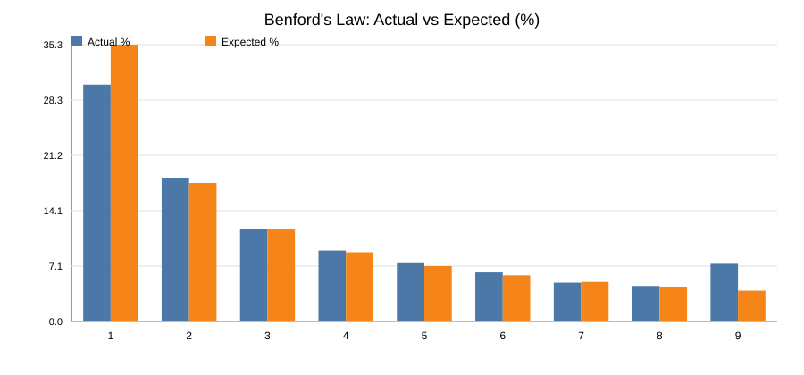
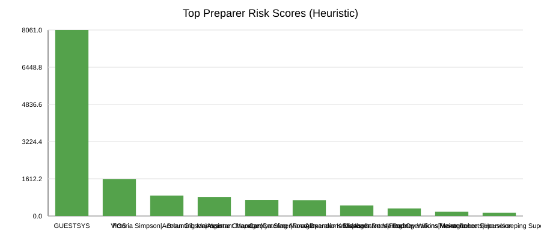

# Fraud Analysis Report

## Visual Summary

## Data Summary
- Total journal line items: 37905
- 95th percentile absolute amount: 8,400.00
- 99th percentile absolute amount: 48,068.12

## Benford's Law Check (Leading Digit Distribution)
| Digit | Actual % | Expected % | Count |
| --- | --- | --- | --- |
| 1 | 30.24% | 35.35% | 11439 |
| 2 | 18.36% | 17.67% | 6943 |
| 3 | 11.79% | 11.78% | 4458 |
| 4 | 9.06% | 8.84% | 3425 |
| 5 | 7.44% | 7.07% | 2815 |
| 6 | 6.26% | 5.89% | 2369 |
| 7 | 4.95% | 5.05% | 1874 |
| 8 | 4.53% | 4.42% | 1714 |
| 9 | 7.37% | 3.93% | 2786 |

## Highest-Risk Preparers (Heuristic Ranking)
Scoring combines large rounded entries, rounded entries, weekend postings, and duplicate postings.

| Rank | Preparer | Score | Total Entries | Rounded | Large Rounded (>=95th pct) | Weekend | Duplicate Amount+Account+Date |
| --- | --- | --- | --- | --- | --- | --- | --- |
| 1 | GUESTSYS | 8061.0 | 6826 | 6424 | 456 | 820 | 3117 |
| 2 | POS | 1605.0 | 7892 | 250 | 2 | 1384 | 92 |
| 3 | Victoria Simpson|Accounting Manager | 886.0 | 6144 | 1068 | 44 | 104 | 160 |
| 4 | Brian Gibson|Assistant Manager             | 828.0 | 1970 | 944 | 94 | 22 | 146 |
| 5 | Yvonne Chapman|Catering Manager               | 701.0 | 1572 | 770 | 74 | 160 | 8 |
| 6 | Carolyn Slater|Food Operations Manager        | 687.0 | 5658 | 810 | 6 | 62 | 208 |
| 7 | Alexander Knox|Assistant Manager             | 456.0 | 842 | 416 | 38 | 32 | 140 |
| 8 | Elizabeth Rees|Food Operations Manager        | 326.0 | 4444 | 472 | 2 | 48 | 38 |
| 9 | Rodney Wilkins|Maintenance Supervisor | 189.0 | 976 | 166 | 0 | 18 | 88 |
| 10 | Trevor Roberts|Housekeeping Supervisor        | 139.0 | 896 | 182 | 0 | 14 | 34 |

## Accounts with Large Rounded Entries (>=95th percentile)
| Account | Count | Total Amount | Top Preparers |
| --- | --- | --- | --- |
| 11845 - Operating Bank Account | 342 | 8,346,648.00 | GUESTSYS (228), Brian Gibson|Assistant Manager             (47), Yvonne Chapman|Catering Manager               (37) |
| 43180 - Rents - Hotels | 261 | 6,045,022.00 | GUESTSYS (228), Yvonne Chapman|Catering Manager               (33) |
| 16200 - Buildings & Building Improvements | 30 | 1,334,332.00 | Brian Gibson|Assistant Manager             (27), Victoria Simpson|Accounting Manager (3) |
| 12987 - Food Service Conference Accounts Receivable  | 8 | 985,468.00 | Victoria Simpson|Accounting Manager (8) |
| 21103 - Accounts Payable | 8 | 985,468.00 | Victoria Simpson|Accounting Manager (8) |
| 71400 - Supplies and Materials | 26 | 642,158.00 | Brian Gibson|Assistant Manager             (14), Alexander Knox|Assistant Manager             (12) |
| 43310 - Sales - Dining Halls | 8 | 534,911.00 | Yvonne Chapman|Catering Manager               (4), Victoria Simpson|Accounting Manager (3), POS (1) |
| 86100 - Depreciation Expense - Building | 2 | 306,094.00 | Victoria Simpson|Accounting Manager (2) |
| 71500 - Repairs and Maintenance | 2 | 306,094.00 | Victoria Simpson|Accounting Manager (2) |
| 74201 - Advertising - General | 10 | 237,239.00 | Brian Gibson|Assistant Manager             (6), Alexander Knox|Assistant Manager             (3), Victoria Simpson|Accounting Manager (1) |

## Example High-Risk Lines (Score >= 3)
| Preparer | Account | Account Name | Entry Date | Amount | Description | Source |
| --- | --- | --- | --- | --- | --- | --- |
| GUESTSYS | 11845 | Operating Bank Account | 2014-06-27 | 48,884.00 | CREDIT CARD RECEIPTS | CREDIT CARD RECEIPT |
| GUESTSYS | 43180 | Rents - Hotels | 2014-06-27 | 48,884.00 | CREDIT CARD RECEIPTS | CREDIT CARD RECEIPT |
| GUESTSYS | 11845 | Operating Bank Account | 2014-07-27 | 99.00 | MERRITT,TAYLOR | CASH RECEIPT |
| GUESTSYS | 43180 | Rents - Hotels | 2014-07-27 | 99.00 | MERRITT,TAYLOR | CASH RECEIPT |
| GUESTSYS | 11845 | Operating Bank Account | 2014-07-27 | 99.00 | OCHOA,AXEL | CASH RECEIPT |
| Victoria Simpson|Accounting Manager | 12987 | Food Service Conference Accounts Receivable  | 2015-08-31 | 97,639.00 | UNIVERSITY BACK-TO-SCHOOL PARTY, AUTHORIZED 30 DAY CREDIT | REGULAR JV |
| Victoria Simpson|Accounting Manager | 43310 | Sales - Dining Halls | 2015-08-31 | 97,639.00 | UNIVERSITY BACK-TO-SCHOOL PARTY, AUTHORIZED 30 DAY CREDIT | REGULAR JV |
| Victoria Simpson|Accounting Manager | 16200 | Buildings & Building Improvements | 2015-09-28 | 97,639.00 | CONSTRUCTION RETENTION SETTLEMENT RELATING TO RENOVATION | REGULAR JV |
| Victoria Simpson|Accounting Manager | 21103 | Accounts Payable | 2015-09-28 | 97,639.00 | CONSTRUCTION RETENTION SETTLEMENT RELATING TO RENOVATION | REGULAR JV |
| Victoria Simpson|Accounting Manager | 21103 | Accounts Payable | 2015-09-30 | 97,639.00 | OFFSET UNIVERSITY RELATED ACCOUNTS | REGULAR JV |
| Brian Gibson|Assistant Manager             | 16200 | Buildings & Building Improvements | 2015-01-23 | 48,500.00 | DALTON CARPET ONE | CHECK |
| Brian Gibson|Assistant Manager             | 11845 | Operating Bank Account | 2015-01-23 | 48,500.00 | DALTON CARPET ONE | CHECK |
| Brian Gibson|Assistant Manager             | 16200 | Buildings & Building Improvements | 2015-06-26 | 81,700.00 | DSI CONSTRUCTION | REGULAR JV |
| Brian Gibson|Assistant Manager             | 11845 | Operating Bank Account | 2015-06-26 | 81,700.00 | DSI CONSTRUCTION | REGULAR JV |
| Brian Gibson|Assistant Manager             | 16200 | Buildings & Building Improvements | 2015-12-16 | 61,090.00 | MAYS ARCHITECTURE & INTERIOR | CHECK |
| Yvonne Chapman|Catering Manager               | 11845 | Operating Bank Account | 2015-06-10 | 90,885.00 | CONFERENCE - HOTEL | CREDIT CARD RECEIPT |
| Yvonne Chapman|Catering Manager               | 43180 | Rents - Hotels | 2015-06-10 | 90,885.00 | CONFERENCE - HOTEL | CREDIT CARD RECEIPT |
| Yvonne Chapman|Catering Manager               | 11845 | Operating Bank Account | 2015-09-03 | 124,258.00 | CONFERENCE - HOTEL | CREDIT CARD RECEIPT |
| Yvonne Chapman|Catering Manager               | 43180 | Rents - Hotels | 2015-09-03 | 124,258.00 | CONFERENCE - HOTEL | CREDIT CARD RECEIPT |
| Yvonne Chapman|Catering Manager               | 11845 | Operating Bank Account | 2016-02-05 | 75,837.00 | CONFERENCE - FOOD SERVICE | CREDIT CARD RECEIPT |
